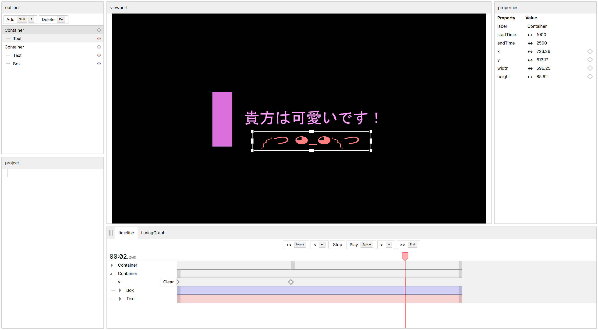

# Nahara's Motion
Motion graphics editor.

- Runs locally in your browser
- No internet access required (except for first-time users)
- Free and open source ([MIT License](./LICENSE))



## Quick links
- [Documentation](./docs/README.md)

## Getting started
### Getting the tools
```sh
apt install nodejs npm
npm install -g pnpm # We use pnpm workspace, so we need to install pnpm
```

### Build Nahara's Motion Engine
```sh
cd nahara-motion
pnpm install
pnpm build
```

### Open Nahara's Motion UI
```sh
cd nahara-motion-ui
pnpm install
pnpm dev
# Open 127.0.0.1:5173 to see the app
```